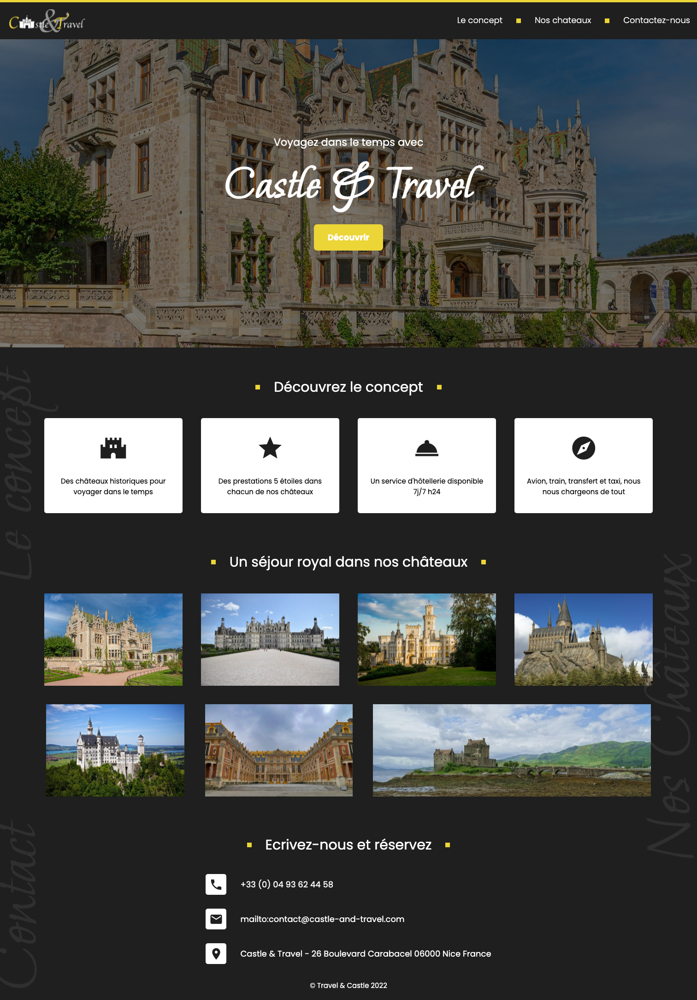
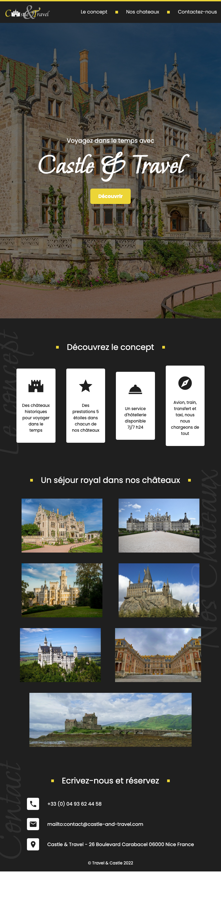
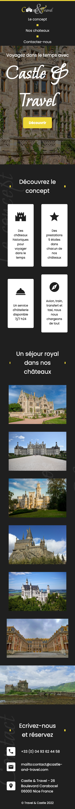

# Exercice 1: Castle & Travel 🏰 Le Bocal

## Le Sujet

Pour cet exercice, j'ai intégrer un site web sur la base des maquettes.

### Charte de couleurs

&nbsp;#ecd537&nbsp; &nbsp;#1f1f1f&nbsp;

### Maquette 1512x753 (Ordinateur portable)

### Maquette 820x1180 (Tablette)

### Maquette 390x844 (Smartphone)

